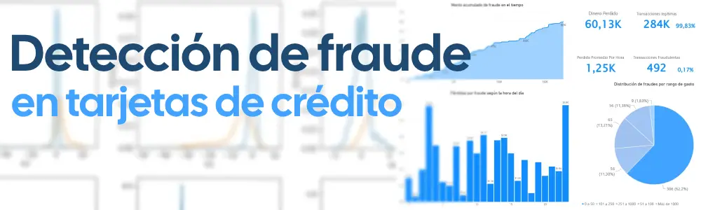
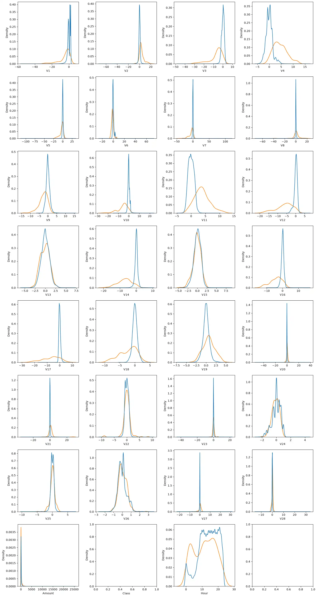
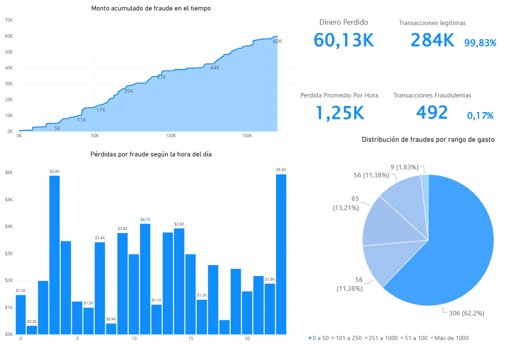
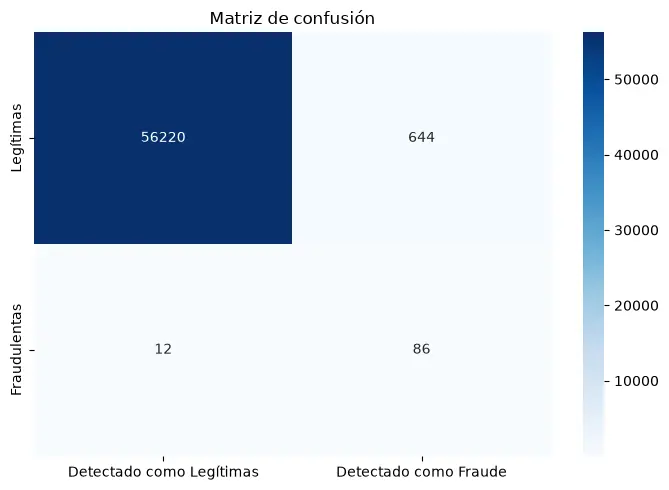
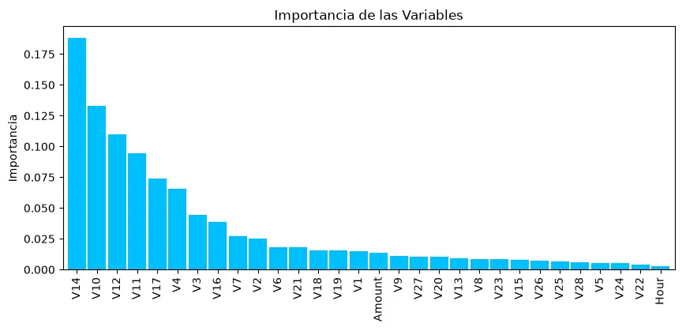

Proyecto de análisis de datos y machine learning orientado a la **detección de transacciones fraudulentas con tarjetas de crédito**. El proyecto combina análisis exploratorio en Python, visualizaciones, un modelo de clasificación basado en **Random Forest** y un dashboard en **Power BI** para analizar el comportamiento y las pérdidas por fraude.

## Índice

- [Descripción del proyecto](#descripción-del-proyecto)
- [Dataset](#dataset)
- [Objetivos](#objetivos)
- [Análisis exploratorio](#análisis-exploratorio)
    - [Preparación de los datos](#preparación-de-los-datos)
    - [Distribución de las variables](#distribución-de-las-variables)
    - [Importancia de las variables](#importancia-de-las-variables)
- [Visualización en Power BI](#visualización-en-power-bi)
- [Random Forest](#random-forest)
    - [Entrenamiento](#entrenamiento-y-umbral-de-decisión)
    - [Resultados](#resultados)
    - [Interpretación de los resultados](#interpretación-de-los-resultados)
- [Conclusiones](#conclusiones)


---

## Descripción del proyecto

Las transacciones fraudulentas representan un problema relevante para las entidades financieras y para los clientes. Un sistema de detección de fraude debe ser capaz de identificar operaciones sospechosas sin generar una cantidad excesiva de falsas alarmas.

En este proyecto se analiza un conjunto de transacciones con el objetivo de identificar patrones asociados al fraude y construir un modelo capaz de clasificar nuevas operaciones como **fraudulentas** o **legítimas**.

El análisis se divide en tres partes principales:

1. **Exploración y preparación de los datos con Python.**
    
2. **Modelado predictivo mediante Random Forest.**
    
3. **Análisis visual de las pérdidas y del comportamiento de las transacciones mediante Power BI.**

---

## Dataset

El conjunto de datos corresponde a transacciones realizadas con tarjetas de crédito en legseptiembre de 2013 por titulares de tarjetas europeas. Contiene **284.807 transacciones**, de las cuales **492 fueron fraudulentas**, por lo que la clase positiva representa aproximadamente el **0,172 %** del total.

El dataset presenta, por tanto, un **fuerte desequilibrio de clases**: la gran mayoría de las operaciones son legítimas y solo una pequeña proporción corresponde a fraude.

Las variables `V1` a `V28` son componentes principales obtenidos mediante una transformación **PCA**. Por motivos de confidencialidad, no se proporcionan las variables originales.

Las variables principales utilizadas en el proyecto son:

|Variable|Descripción|
|---|---|
|`V1` - `V28`|Componentes principales obtenidos mediante PCA.|
|`Time`|Segundos transcurridos desde la primera transacción del dataset.|
|`Amount`|Importe de la transacción.|
|`Class`|Variable objetivo: `0` = operación legítima, `1` = fraude.|
|`Hour`|Hora del día derivada a partir de `Time`.|

### El principal desafío: el desbalance de clases

El desbalance es especialmente importante en este problema. Un modelo que predijera casi todas las operaciones como legítimas podría obtener una exactitud elevada y, al mismo tiempo, ser prácticamente inútil para detectar fraudes.

Por este motivo, además de la accuracy, se consideran métricas como **recall, precision y F1-score**, prestando especial atención a la capacidad del modelo para recuperar los casos fraudulentos.

---

## Objetivos

El proyecto busca:

- Explorar el comportamiento de las transacciones fraudulentas y legítimas.
    
- Analizar la distribución de las variables disponibles.
    
- Incorporar la variable `Hour` para estudiar el comportamiento por hora del día.
    
- Construir un modelo de clasificación mediante Random Forest.
    
- Evaluar el modelo con una matriz de confusión y métricas apropiadas para un problema desbalanceado.
    
- Analizar qué variables tienen mayor importancia para el modelo.
    
- Utilizar Power BI para complementar el análisis con visualizaciones orientadas a pérdidas, horarios y distribución del fraude.

---

## Análisis exploratorio

### Preparación de los datos

Primero se carga el dataset y se crea una nueva variable denominada `Hour`, calculada a partir de `Time`. Después, `Time` se elimina para trabajar con la hora del día derivada.

```
from pathlib import Path
import pandas as pd

DATA_PATH = Path("data/creditcard.csv")
df = pd.read_csv(DATA_PATH)

df["Hour"] = (df["Time"] // (60 * 60)) % 24
df = df.drop(columns="Time")

df.head()
```


| inx | V1        | V2        | V3       | V4        | V5        | V6        | V7        | V8       | V9        | ...       | V21 | V22       | V23       | V24       | V25       | V26       | V27       | V28       | Amount | Class | Hour |
| --- | --------- | --------- | -------- | --------- | --------- | --------- | --------- | -------- | --------- | --------- | --- | --------- | --------- | --------- | --------- | --------- | --------- | --------- | ------ | ----- | ---- |
| 0   | -1.359807 | -0.072781 | 2.536347 | 1.378155  | -0.338321 | 0.462388  | 0.239599  | 0.098698 | 0.363787  | 0.090794  | ... | 0.277838  | -0.110474 | 0.066928  | 0.128539  | -0.189115 | 0.133558  | -0.021053 | 149.62 | 0     | 0.0  |
| 1   | 1.191857  | 0.266151  | 0.166480 | 0.448154  | 0.060018  | -0.082361 | -0.078803 | 0.085102 | -0.255425 | -0.166974 | ... | -0.638672 | 0.101288  | -0.339846 | 0.167170  | 0.125895  | -0.008983 | 0.014724  | 2.69   | 0     | 0.0  |
| 2   | -1.358354 | -1.340163 | 1.773209 | 0.379780  | -0.503198 | 1.800499  | 0.791461  | 0.247676 | -1.514654 | 0.207643  | ... | 0.771679  | 0.909412  | -0.689281 | -0.327642 | -0.139097 | -0.055353 | -0.059752 | 378.66 | 0     | 0.0  |
| 3   | -0.966272 | -0.185226 | 1.792993 | -0.863291 | -0.010309 | 1.247203  | 0.237609  | 0.377436 | -1.387024 | -0.054952 | ... | 0.005274  | -0.190321 | -1.175575 | 0.647376  | -0.221929 | 0.062723  | 0.061458  | 123.50 | 0     | 0.0  |
| ... | ...       | ...       | ...      | ...       | ...       | ...       | ...       | ...      | ...       | ...       | ... | ...       | ...       | ...       | ...       | ...       | ...       | ...       | ...    | ...   | ...  |

Después de esta transformación, el dataframe conserva las variables `V1` a `V28`, `Amount` y `Class`, y añade `Hour` como nueva variable temporal.

### División entre entrenamiento y prueba

Para evaluar el modelo se separan los datos en un conjunto de entrenamiento y otro de prueba, utilizando el 80 % para entrenar y el 20 % para evaluar.

```
from sklearn.model_selection import train_test_split

X = df.drop(columns="Class")
y = df["Class"]

X_train, X_test, y_train, y_test = train_test_split(
    X,
    y,
    test_size=0.2,
    random_state=10,
)
```

### Distribución de las variables

Se utilizaron gráficos de densidad (`KDE`) para comparar la distribución de las variables entre operaciones legítimas y fraudulentas.

Estos gráficos permiten detectar visualmente variables cuya distribución difiere entre ambas clases. En un problema de fraude, este tipo de separación resulta especialmente útil para comprender qué características pueden aportar información al modelo.

```
import matplotlib.pyplot as plt
import seaborn as sns

fig, axes = plt.subplots(nrows=8, ncols=4, figsize=(16, 30))
axes = axes.flatten()

for i, column in enumerate(df.columns):
    sns.kdeplot(
        data=df,
        x=column,
        hue="Class",
        common_norm=False,
        legend=False,
        ax=axes[i],
    )

plt.tight_layout()
plt.show()
```


---

## Visualización en Power BI

La principal ventaja de esta parte del proyecto es que permite pasar del análisis exploratorio a una vista más ejecutiva, donde los resultados pueden interpretarse rápidamente y utilizarse para identificar patrones de interés.



---

## Random Forest

Para la clasificación se utilizó **Random Forest**, un algoritmo de aprendizaje supervisado basado en un conjunto de árboles de decisión.

La idea general consiste en entrenar múltiples árboles y combinar sus predicciones. Esta estrategia permite capturar relaciones no lineales entre las variables y suele funcionar bien en problemas de clasificación con muchas características.

En este proyecto se utilizó:

```
from sklearn.ensemble import RandomForestClassifier

rf = RandomForestClassifier(
    class_weight="balanced",
    n_jobs=-1,
)
```

El parámetro `class_weight="balanced"` es especialmente relevante en este caso, porque el dataset está muy desbalanceado. De esta forma, el modelo asigna un peso mayor a la clase minoritaria durante el entrenamiento.

### Entrenamiento y umbral de decisión

El modelo se entrena con el conjunto de entrenamiento y se obtienen probabilidades de fraude para las operaciones del conjunto de prueba.

```
rf.fit(X_train, y_train)

rf_predict = rf.predict_proba(X_test)[:, 1]

threshold = 0.02
rf_pred_opt = (rf_predict >= threshold).astype(int)
```

En lugar de utilizar el umbral habitual de `0.50`, el análisis utiliza un umbral de **0.02**. Esto hace que el sistema sea mucho más sensible a operaciones potencialmente fraudulentas, lo que aumenta la cantidad de casos que consigue detectar, aunque también incrementa las falsas alarmas.

---

## Resultados

La evaluación documentada en el análisis original produjo la siguiente matriz de confusión:

```
cm = confusion_matrix(y_test, rf_pred_opt)

sns.heatmap(
    cm,
    annot=True,
    fmt="d",
    cmap="Blues",
    xticklabels=["Detectado como Legítimas", "Detectado como Fraude"],
    yticklabels=["Legítimas", "Fraudulentas"]
)

plt.title("Matriz de confusión")
plt.tight_layout()
plt.show()
```


A partir de esta matriz se obtienen las siguientes métricas:

| Métrica       | Resultado   |
| ------------- | ----------- |
| **Recall**    | **90,43 %** |
| **Precision** | **11,29 %** |
| **F1-score**  | **20,07 %** |
| **Accuracy**  | **98,81 %** |

### Interpretación de los resultados

El resultado más destacable es el **recall del 90,43 %**: de los 94 fraudes presentes en el conjunto de prueba, el modelo consiguió identificar **85** y dejó pasar **9**.

Sin embargo, el modelo también clasificó erróneamente **668 operaciones legítimas como fraude**. Esto se refleja en una **precision del 11,29 %**, es decir, aproximadamente 11 de cada 100 operaciones marcadas por el modelo como sospechosas fueron realmente fraudulentas.

Este punto es importante porque muestra que el modelo no debe evaluarse únicamente mediante accuracy. El **98,81 % de accuracy** parece elevado, pero en un dataset tan desbalanceado puede ocultar un problema de falsas alarmas.

El resultado puede interpretarse como un compromiso entre dos objetivos:

- **Reducir falsos negativos:** detectar la mayor cantidad posible de fraudes.
    
- **Reducir falsos positivos:** evitar marcar demasiadas operaciones legítimas como sospechosas.
    

Con el umbral utilizado (`0.02`), el modelo se inclina claramente hacia una mayor sensibilidad al fraude. Esto puede ser útil en una primera etapa de detección, pero el costo de revisar las falsas alarmas debe tenerse en cuenta antes de utilizar el modelo en un entorno real.

---

## Importancia de las variables

Random Forest permite estimar la importancia relativa de las variables utilizadas durante el entrenamiento. Esto ayuda a identificar qué características aportaron más información a la clasificación.

```
pd.Series(
    rf.feature_importances_,
    index=x_train.columns
    ).sort_values(
    ascending=False
	    ).plot(
    kind='bar', 
    figsize=(10, 4), 
    color='#00BFFF',
    width=0.9)

plt.title('Importancia de las Variables')
plt.ylabel('Importancia')
plt.show()
```



Este gráfico no implica que una variable sea una causa del fraude. La importancia representa cuánto contribuyó cada variable al funcionamiento del modelo dentro del dataset analizado

---

## Conclusiones

El proyecto muestra que es posible utilizar técnicas de machine learning para detectar transacciones fraudulentas en un conjunto de datos altamente desbalanceado.

El modelo **Random Forest**, acompañado por `class_weight="balanced"` y un umbral de decisión de `0.02`, consiguió recuperar **85 de los 94 fraudes presentes en el conjunto de prueba**, alcanzando un `recall` del **90,43 %**.

Al mismo tiempo, el modelo generó **668 falsos positivos**, por lo que su `precision` quedó en **11,29 %**. Este resultado muestra que detectar una gran proporción del fraude tiene como contrapartida un número importante de operaciones legítimas clasificadas como sospechosas.

Una mejora importante sería definir explícitamente el costo de un falso negativo y de un falso positivo para elegir el umbral de decisión en función del impacto económico.

Por lo tanto, el análisis no demuestra que exista un único umbral óptimo: la elección depende del costo que tenga para la organización dejar pasar un fraude frente al costo de investigar una falsa alarma. En un sistema real, esta decisión debería acompañarse de un análisis económico y operativo.
